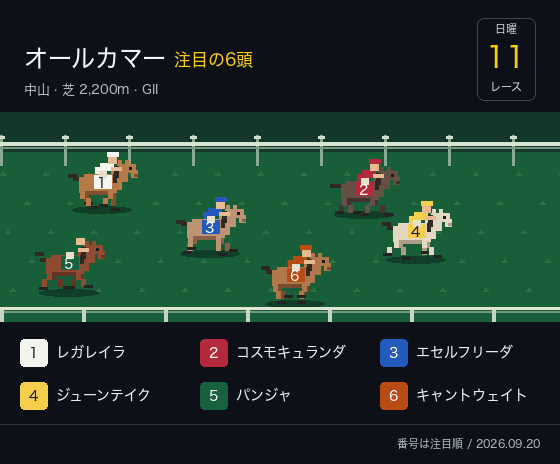

## Hey, machamp here! :wave:

<!--START_SECTION:featured-race-->

<!--END_SECTION:featured-race-->

---

<h3>🔍 Where to find me</h3>

<p>
<a href="https://zenn.dev/machamp" target="_blank"></a>
<a href="https://github.com/machamp0714" target="_blank"></a>
</p>

<h3>💚 My Favorite Tech</h3>

<table>
  <tr>
    <td align="center" width="96">
      <a href="#">
        
      </a>
      <br>Ruby
    </td>
    <td align="center" width="96">
      <a href="#">
        
      </a>
      <br>Terraform
    </td>
    <td align="center" width="96">
      <a href="#">
        
      </a>
      <br>TypeScript
    </td>
  </tr>
  <tr>
    <td align="center" width="96">
      <a href="#">
        
      </a>
      <br>Rails
    </td>
    <td align="center" width="96">
      <a href="#">
        
      </a>
      <br>AWS
    </td>
    <td align="center" width="96">
      <a href="#">
        
      </a>
      <br>React
    </td>
  </tr>
</table>

<!--START_SECTION:waka-->

```txt
No activity tracked
```

<!--END_SECTION:waka-->
